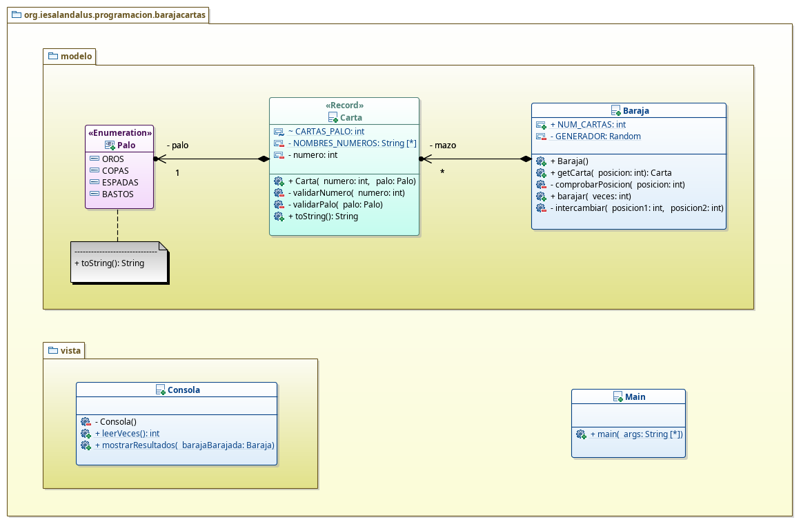

# BarajaCartas
## José Ramón Jimenez Reyes

Debes crear un programa que modele una baraja de cartas, simule que intercambias cartas de posiciones aleatorias n veces y muestre las se han quedado en la misma posición inicial y cuántas han sido. Para ello te propongo el siguiente diagrama de clases:

Las tareas que debes realizar son las siguientes:

- Crea un enumerado llamado `Palo` con cada uno de los palos de una baraja de cartas española: OROS, COPAS, ESPADAS, BASTOS.
    - El método `toString` deberar serializarla con el nombre del palo comenzando en mayúscula y continando en minúsuclas.
- Crea el registro `Carta`:
    - Los atributos serán: `numero` y `palo`.
    - Declara e incializa la constante `CARTAS_PALO` que será igual a 12 y otra como una array de cadenas con los nombres de los números.
    - Implementa el constructor canónico que deberá validar el número y el palo, utilizando los métodos `validarNumero` y `validarPalo`.
    - Implementa el método `validarNumero` que deberá validar el número o lanzará la excepción adecuada.
    - Implementa el método `validarPalo` comprobando que no sea nulo o lanzando la excepción adecuada.
    - Implementa el método `toString` que represente una carta de la forma: As de Oros, Dos de Copas, ..., Sota de Espadas, Caballo de Oros, Rey de Bastos.
- Crea la clase `Baraja`:
    - Declara e incializa la constante `NUM_CARTAS` que será igual a 4 por las cartas de un palo y `GENERADOR` que será un nuevo generador de números aleatorios.
    - Declara el atributo `mazo` que será un array de Cartas que tendrá como máximo `NUM_CARTAS`.
    - Implementa un constructor por defecto que inicialice el array poniendo en primer lugar las 12 cartas de oros, luego las 12 cartas de copas, luego las 12 cartas de espadas y finalmente las 12 cartas de bastos.
    - Implementa un método llamado `getCarta` que dada una posición devuelva la carta que ocupa dicha posición en la baraja. Debes validar que la posición indicada sea correcta, debiendo lanzar la excepción `IllegalArgumentException` con el mensaje adecuado.
    - Implementa un método llamado `intercambiar` que acepte las posiciónes de dos cartas y las intercambia en el array de cartas, es decir, en la posición primera pone la carta que ocupaba la posición segunda y viceversa. 
    - Implementa un método llamado `barajar` que acepte como parámetro un entero indicando las veces que queremos intercambiar dos cartas. Para ello generarás dos números aleatorios entre `0` y `NUM_CARTAS` e intercambiará las cartas de dichas posiciones y esto lo repetirás las veces que indique el parámetro.
  - Crea la clase `Consola`: 
    - Implementa un constructor privado para evitar que se puedan crear objetos de esta clase, ya que será una clase de utilidades.
    - Implementa el método `leerVeces` que mostrará un mensaje indicando que introduzcamos el número de veces a barajar y nos devolverá el entero leído.
    - Implementa el método `mostrarResultados` que recibirá como parámetro una baraja ya barajada, la comparará con una ordenada y nos indicará las cartas que no han cambiado y finalmente cuántas han sido.
- Crea una clase Principal que haciendo uso de la clase `Consola`, pida el número de veces a barajar y muestre los resultados.